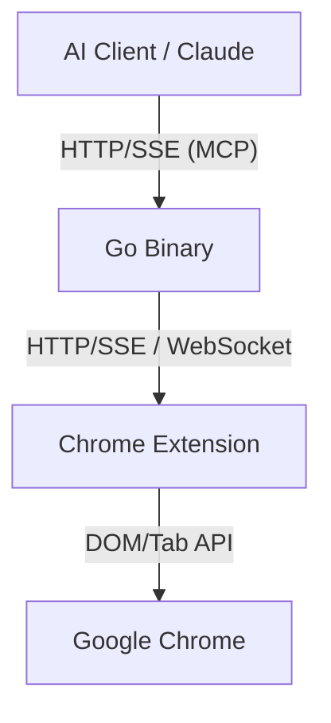

# 🚀 Ultra Browser — Chrome MCP Server

[](https://go.dev/)
[](https://developer.chrome.com/docs/extensions)
[](https://modelcontextprotocol.io/)

**Ultra Browser** é um servidor MCP (Model Context Protocol) de alto desempenho que atua como uma ponte entre clientes de IA (como Claude Desktop, Gemini, etc.) e o navegador Google Chrome. Ele permite automação completa, extração de dados e interação com o DOM diretamente através de uma interface padronizada.

---

## 🏗️ Arquitetura do Sistema

O projeto utiliza uma **Arquitetura Hexagonal** (Ports and Adapters) para garantir pureza no domínio e facilidade de manutenção, mantendo zero dependências externas (apenas a `stdlib` do Go).

### Componentes Principais
1.  **Go Binary (Backend):** Atua como o servidor MCP (JSON-RPC 2.0 via HTTP/SSE) e gerencia a comunicação com a extensão.
2.  **Chrome Extension (Executor):** Uma extensão Manifest V3 que executa as ferramentas dentro das abas do navegador (manipulação de DOM, screenshots, etc.).
3.  **Bridge Hub:** Gerencia o transporte ativo (HTTP/SSE ou WebSocket) para comunicação bi-direcional com o navegador.



---

## 🛠️ Ferramentas MCP Disponíveis

O sistema expõe diversas capacidades de automação para a IA:

| Ferramenta | Descrição |
| :--- | :--- |
| `list_tabs` | Lista todas as janelas e abas abertas. |
| `navigate` | Navega para uma URL (aba ativa ou nova). |
| `screenshot` | Captura um screenshot da aba ativa (PNG). |
| `get_content` | Extrai todo o conteúdo de texto da página. |
| `click` | Clica em um elemento via seletor CSS. |
| `type_text` | Digita texto em campos de formulário. |
| `execute_script` | Executa JavaScript arbitrário na página. |
| `capture_node` | Captura um elemento específico (PNG ou HTML). |
| `wait_for_element` | Aguarda a aparição de um elemento no DOM. |
| `upload_file` | Realiza o upload de arquivos locais. |
| `scroll` / `hover` | Interações de rolagem e passar o mouse. |

---

## 🚀 Como Começar

### 1. Requisitos
- **Go 1.26 ou superior**
- **Google Chrome**

### 2. Configuração do Backend (Go)
Compile o binário:

```bash
# Compilar o executável
go build -o ultra-browser .
```

### 3. Configuração da Extensão (Chrome)
1.  Abra `chrome://extensions` no seu navegador.
2.  Ative o **"Modo do desenvolvedor"** no canto superior direito.
3.  Clique em **"Carregar sem compactação"** e selecione a pasta `extension/` deste repositório.

### 4. Executando
Para iniciar o servidor MCP:

```bash
./ultra-browser
```

### 5. Using the MCP Tools

Configure your AI client to use the MCP server at
```bash
 http://localhost:12306/mcp
```
---

## 💻 Comandos de Desenvolvimento

| Comando | Descrição |
| :--- | :--- |
| `go test ./...` | Executa todos os testes unitários. |

---

## 🔒 Segurança e Privacidade

- **Sandbox Local:** As ferramentas `capture_node` e `upload_file` são restritas ao diretório de execução para evitar travessia de caminhos (`path traversal`).
- **Comunicação Segura:** O binário atua como um hub, permitindo diferentes adaptadores de transporte com validação.
- **Transparência:** Todas as ações são executadas na sua instância local do Chrome.

---

## 📈 Status do Projeto

- [x] Definição da Arquitetura e PRD.
- [x] Implementação do Bridge Hub agnóstico.
- [x] Servidor MCP (HTTP/SSE/JSON-RPC).
- [x] Extensão Chrome Base.
- [x] Ferramentas essenciais de navegação e extração.
- [ ] Suporte a múltiplos perfis de navegador.
- [ ] Modo Headless (opcional).

---

## 📄 Licença

Distribuído sob a licença MIT. Veja `LICENSE` para mais informações (se disponível).

---
*Desenvolvido por João com foco em performance e minimalismo.*
